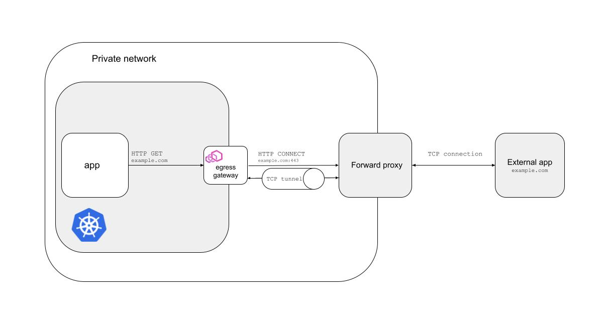

## Proof of concept of tunneling outgoing traffic by Istio egress gateway via external HTTPS proxy



### Requirements

#### Envoy
```sh
./envoy/get-envoy.sh
```

#### Istio
Follow the instructions from the official documentation: https://istio.io/latest/docs/setup/getting-started/#download.

#### Kubernetes
```sh
wget -O k0s https://github.com/k0sproject/k0s/releases/download/v1.23.1+k0s.1/k0s-v1.23.1+k0s.1-amd64
chmod u+x k0s
```

### How to run the demo
1. Run VMs
```sh
vagrant up
```

2. Configure kube config file
```sh
vagrant ssh k8s -c 'sudo cat /var/lib/k0s/pki/admin.conf' > ~/.kube/config-vagrant-k0s
export KUBECONFIG=~/.kube/config-vagrant-k0s
```

3. Install Istio
```sh
istioctl install -y \
    --set profile=demo \
    --set meshConfig.outboundTrafficPolicy.mode=REGISTRY_ONLY
```

4. Apply the following resources
```sh
kubectl label namespace default istio-injection=enabled
kubectl apply -f samples/sleep/sleep.yaml
kubectl apply -f google-external-service-entry.yaml
kubectl exec $(kubectl get pods -l app=sleep -o jsonpath='{.items[].metadata.name}') -c sleep -- curl -v -sSL -o /dev/null -D - https://www.google.com
kubectl apply -f envoy-filter.yaml
kubectl exec $(kubectl get pods -l app=sleep -o jsonpath='{.items[].metadata.name}') -c sleep -- curl -v -sSL -o /dev/null -D - https://www.google.com
```
