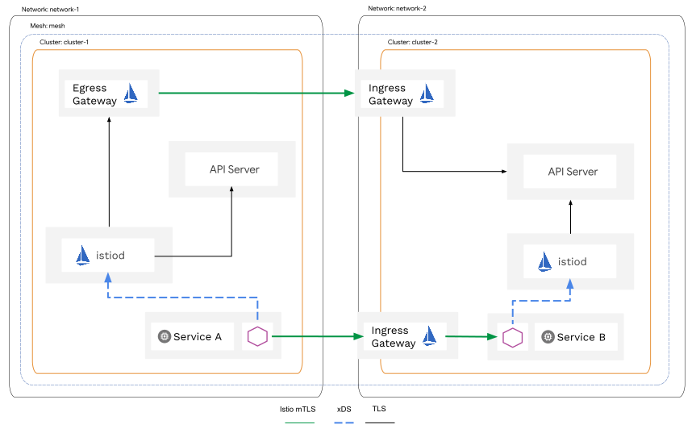

## Securing access to remote kube-apiserver with Istio mTLS



### Prerequisites

1. Create 2 OpenShift clusters.
2. Install OpenShift Service Mesh Operator v3.0.0 or Sail Operator.
3. Install community version of `istioctl`.

### Steps

1. Setup environment variables and aliases:
```shell
export EAST_AUTH_PATH=
export WEST_AUTH_PATH=
export EAST_API_TLS_SERVER_NAME=
export WEST_API_TLS_SERVER_NAME=
export ISTIO_VERSION=1.24.3
```
```shell
# east
alias keast="KUBECONFIG=$EAST_AUTH_PATH/kubeconfig kubectl"
alias istioctl-east="istioctl --kubeconfig=$EAST_AUTH_PATH/kubeconfig"
alias helm-east="KUBECONFIG=$EAST_AUTH_PATH/kubeconfig helm"
# west
alias kwest="KUBECONFIG=$WEST_AUTH_PATH/kubeconfig kubectl"
alias istioctl-west="istioctl --kubeconfig=$WEST_AUTH_PATH/kubeconfig"
alias helm-west="KUBECONFIG=$WEST_AUTH_PATH/kubeconfig helm"
```

2. Download tools for certificate generation:
```shell
wget https://raw.githubusercontent.com/istio/istio/release-1.24/tools/certs/common.mk -O common.mk
wget https://raw.githubusercontent.com/istio/istio/release-1.24/tools/certs/Makefile.selfsigned.mk -O Makefile.selfsigned.mk
```

3. Create shared root certificate:
```shell
make -f Makefile.selfsigned.mk \
  ROOTCA_CN="East Root CA" \
  ROOTCA_ORG=my-company.org \
  root-ca
make -f Makefile.selfsigned.mk \
  INTERMEDIATE_CN="East Intermediate CA" \
  INTERMEDIATE_ORG=my-company.org \
  east-cacerts
make -f Makefile.selfsigned.mk \
  INTERMEDIATE_CN="West Intermediate CA" \
  INTERMEDIATE_ORG=my-company.org \
  west-cacerts
make -f common.mk clean
```

4. Create istio-system namespace in each cluster:
```shell
keast create ns istio-cni
keast create ns istio-system
keast label namespace istio-system topology.istio.io/network=east-network
kwest create ns istio-cni
kwest create ns istio-system
kwest label namespace istio-system topology.istio.io/network=west-network
```

5. Create CAs in each cluster:
```shell
keast create secret generic cacerts -n istio-system \
  --from-file=root-cert.pem=east/root-cert.pem \
  --from-file=ca-cert.pem=east/ca-cert.pem \
  --from-file=ca-key.pem=east/ca-key.pem \
  --from-file=cert-chain.pem=east/cert-chain.pem
kwest create secret generic cacerts -n istio-system \
  --from-file=root-cert.pem=west/root-cert.pem \
  --from-file=ca-cert.pem=west/ca-cert.pem \
  --from-file=ca-key.pem=west/ca-key.pem \
  --from-file=cert-chain.pem=west/cert-chain.pem
```

6. Install Istio in each cluster:
```shell
keast apply -f - <<EOF
apiVersion: sailoperator.io/v1
kind: IstioCNI
metadata:
  name: default
spec:
  version: v${ISTIO_VERSION}
  namespace: istio-cni
---
apiVersion: sailoperator.io/v1
kind: Istio
metadata:
  name: default
spec:
  version: v${ISTIO_VERSION}
  namespace: istio-system
  values:
    meshConfig:
      accessLogFile: /dev/stdout
      defaultConfig:
        proxyMetadata:
          ISTIO_META_DNS_CAPTURE: "true"
          ISTIO_META_DNS_AUTO_ALLOCATE: "true"
    global:
      multiCluster:
        clusterName: east
      network: east-network
EOF
```
```shell
kwest apply -f - <<EOF
apiVersion: sailoperator.io/v1
kind: IstioCNI
metadata:
  name: default
spec:
  version: v${ISTIO_VERSION}
  namespace: istio-cni
---
apiVersion: sailoperator.io/v1
kind: Istio
metadata:
  name: default
spec:
  version: v${ISTIO_VERSION}
  namespace: istio-system
  values:
    meshConfig:
      accessLogFile: /dev/stdout
      defaultConfig:
        proxyMetadata:
          ISTIO_META_DNS_CAPTURE: "true"
          ISTIO_META_DNS_AUTO_ALLOCATE: "true"
    global:
      multiCluster:
        clusterName: west
      network: west-network
EOF
```

7. Create east-west gateways:
```shell
cat <<EOF > istio-eastwestgateway-values.yaml
global:
  platform: openshift

service:
  ports:
  - name: status-port
    port: 15021
    targetPort: 15021
  - name: tls
    port: 15443
    targetPort: 15443
  - name: tls-istiod
    port: 15012
    targetPort: 15012
  - name: tls-webhook
    port: 15017
    targetPort: 15017
  - name: istio-mtls-kube-api-server
    port: 16443
    targetPort: 16443

env:
  ISTIO_META_REQUESTED_NETWORK_VIEW: \$NETWORK
EOF
cat istio-eastwestgateway-values.yaml | sed "s/\$NETWORK/east-network/g" | helm-east upgrade --install istio-eastwestgateway istio/gateway -n istio-system -f -
cat istio-eastwestgateway-values.yaml | sed "s/\$NETWORK/west-network/g" | helm-west upgrade --install istio-eastwestgateway istio/gateway -n istio-system -f -
```
```shell
keast label svc istio-eastwestgateway -n istio-system topology.istio.io/network=east-network
keast label deploy istio-eastwestgateway -n istio-system topology.istio.io/network=east-network
kwest label svc istio-eastwestgateway -n istio-system topology.istio.io/network=west-network
kwest label deploy istio-eastwestgateway -n istio-system topology.istio.io/network=west-network
```

8. Expose kube-apiserver on the east-west gateway:
```shell
cat <<EOF > istio-eastwestgateway-kube-apiserver.yaml
apiVersion: networking.istio.io/v1
kind: Gateway
metadata:
  name: istio-eastwestgateway-kube-apiserver
  namespace: istio-system
spec:
  selector:
    app: istio-eastwestgateway
  servers:
  - port:
      number: 16443
      name: tls-kubernetes
      protocol: TLS
    tls:
      mode: ISTIO_MUTUAL
    hosts:
    - kube-apiserver-\$LOCAL_CLUSTER.istio-system.svc.cluster.local
---
apiVersion: networking.istio.io/v1
kind: VirtualService
metadata:
  name: istio-eastwestgateway-kube-apiserver
  namespace: istio-system
spec:
  exportTo:
  - "."
  hosts:
  - kube-apiserver-\$LOCAL_CLUSTER.istio-system.svc.cluster.local
  gateways:
  - istio-eastwestgateway-kube-apiserver
  tcp:
  - match:
    - port: 16443
    route:
    - destination:
        host: kubernetes.default.svc.cluster.local
        port:
          number: 443
---
apiVersion: security.istio.io/v1
kind: AuthorizationPolicy
metadata:
 name: deny-all-by-default
 namespace: istio-system
spec:
  {}
---
# We must allow all, because TLS from istiod is not terminated, so we can't verify the client identity
apiVersion: security.istio.io/v1
kind: AuthorizationPolicy
metadata:
 name: allow-all-to-kube-apiserver-\$REMOTE_CLUSTER-egress-gateway
 namespace: istio-system
spec:
  selector:
    matchLabels:
      app: kube-apiserver-\$REMOTE_CLUSTER-egress-gateway
  rules:
  - {}
---
# This network policy secures the above allow-all authz rule
apiVersion: networking.k8s.io/v1
kind: NetworkPolicy
metadata:
  name: allow-istiod-to-kube-apiserver-\$REMOTE_CLUSTER-egress-gateway
  namespace: istio-system
spec:
  podSelector:
    matchLabels:
      app: kube-apiserver-\$REMOTE_CLUSTER-egress-gateway
  ingress:
  - from:
    - podSelector:
        matchLabels:
          app: istiod
  policyTypes:
  - Ingress
---
apiVersion: security.istio.io/v1
kind: AuthorizationPolicy
metadata:
 name: kube-apiserver-\$LOCAL_CLUSTER.istio-system.svc.cluster.local
 namespace: istio-system
spec:
  selector:
    matchLabels:
      app: istio-eastwestgateway
  action: ALLOW
  rules:
  - from:
    - source:
        principals: ["cluster.local/ns/istio-system/sa/kube-apiserver-\$LOCAL_CLUSTER-egress-gateway"]
EOF
cat istio-eastwestgateway-kube-apiserver.yaml | sed -e "s/\$LOCAL_CLUSTER/east/g" -e "s/\$REMOTE_CLUSTER/west/g" | keast apply -f -
cat istio-eastwestgateway-kube-apiserver.yaml | sed -e "s/\$LOCAL_CLUSTER/west/g" -e "s/\$REMOTE_CLUSTER/east/g" | kwest apply -f -
```

10. Create egress gateways dedicated for connecting to the remote kube-apiservers:
```shell
cat <<EOF > kube-apiserver-egress-gateway-values.yaml
global:
  platform: openshift

service:
  type: ClusterIP
  ports:
  - name: remote-kube-apiserver
    port: 443
    protocol: TCP
    targetPort: 443
EOF
cat kube-apiserver-egress-gateway-values.yaml | helm-east upgrade --install kube-apiserver-west-egress-gateway istio/gateway -n istio-system -f -
cat kube-apiserver-egress-gateway-values.yaml | helm-west upgrade --install kube-apiserver-east-egress-gateway istio/gateway -n istio-system -f -
```

11. Configure the egress gateway for remote kube-apiserver:
```shell
cat <<EOF > kube-apiserver-egress-gateway.yaml
apiVersion: networking.istio.io/v1
kind: Gateway
metadata:
  name: kube-apiserver-\$REMOTE_CLUSTER-egress-gateway
  namespace: istio-system
spec:
  selector:
    app: kube-apiserver-\$REMOTE_CLUSTER-egress-gateway
  servers:
  - port:
      number: 443
      name: tls
      protocol: TLS
    tls:
      mode: PASSTHROUGH
    hosts:
    - \$API_SERVER_SNI
---
apiVersion: networking.istio.io/v1
kind: VirtualService
metadata:
  name: kube-apiserver-\$REMOTE_CLUSTER-egress-gateway
  namespace: istio-system
spec:
  exportTo:
  - "."
  hosts:
  - \$API_SERVER_SNI
  gateways:
  - kube-apiserver-\$REMOTE_CLUSTER-egress-gateway
  tls:
  - match:
    - port: 443
      sniHosts:
      - \$API_SERVER_SNI
    route:
    - destination:
        host: kube-apiserver-\$REMOTE_CLUSTER.istio-system.svc.cluster.local
        port:
          number: 16443
---
apiVersion: networking.istio.io/v1
kind: DestinationRule
metadata:
  name: kube-apiserver-\$REMOTE_CLUSTER-egress-gateway
  namespace: istio-system
spec:
  exportTo:
  - "."
  host: kube-apiserver-\$REMOTE_CLUSTER.istio-system.svc.cluster.local
  trafficPolicy:
    tls:
      mode: ISTIO_MUTUAL
      sni: kube-apiserver-\$REMOTE_CLUSTER.istio-system.svc.cluster.local
---
apiVersion: networking.istio.io/v1
kind: ServiceEntry
metadata:
  name: kube-apiserver-\$REMOTE_CLUSTER-egress-gateway
  namespace: istio-system
spec:
  exportTo:
  - "."
  hosts:
  - kube-apiserver-\$REMOTE_CLUSTER.istio-system.svc.cluster.local
  ports:
  - number: 16443
    name: tls
    protocol: TLS
  location: MESH_INTERNAL
  resolution: DNS
  endpoints:
  - address: \$REMOTE_ADDR
  subjectAltNames:
  - "spiffe://cluster.local/ns/istio-system/sa/istio-eastwestgateway"
EOF
WEST_ADDR=$(kwest get svc istio-eastwestgateway -n istio-system -o jsonpath='{.status.loadBalancer.ingress[0].hostname}')
cat kube-apiserver-egress-gateway.yaml | sed -e "s/\$REMOTE_CLUSTER/west/g" -e "s/\$REMOTE_ADDR/$WEST_ADDR/g" -e "s/\$API_SERVER_SNI/$WEST_API_TLS_SERVER_NAME/g" | keast apply -f -
EAST_ADDR=$(keast get svc istio-eastwestgateway -n istio-system -o jsonpath='{.status.loadBalancer.ingress[0].hostname}')
cat kube-apiserver-egress-gateway.yaml | sed -e "s/\$REMOTE_CLUSTER/east/g" -e "s/\$REMOTE_ADDR/$EAST_ADDR/g" -e "s/\$API_SERVER_SNI/$EAST_API_TLS_SERVER_NAME/g" | kwest apply -f -
```

10. Install a remote secret in cluster "east" that provides access to the API server in cluster west:
```shell
istioctl-west create-remote-secret \
  --server=https://kube-apiserver-west-egress-gateway.istio-system.svc.cluster.local:443 \
  --name=west | sed "/server: .*/a\        tls-server-name: $WEST_API_TLS_SERVER_NAME" | keast apply -n istio-system -f -
```

### Cleanup

```shell
helm-east uninstall remote-kubeapiserver-egress-gateway -n istio-system
helm-west uninstall remote-kubeapiserver-egress-gateway -n istio-system
```
