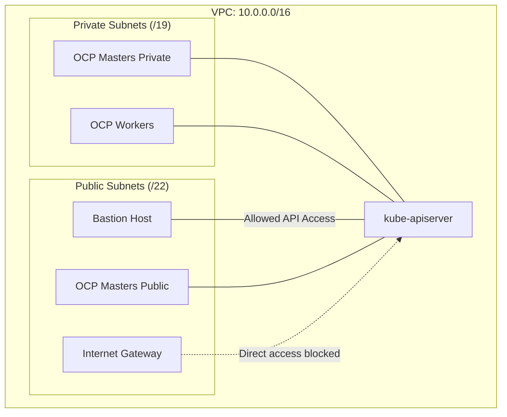

## OpenShift with restricted access to kube-apiserver



### Install OpenShift with default infrastructure settings

```shell
export CLUSTER_NAME=
export REGION=
```

```shell
openshift-install create cluster --dir $CLUSTER_NAME
```

Verify that API server is publicly accessible:
```shell
export KUBECONFIG=./$CLUSTER_NAME/auth/kubeconfig
kubectl get pods --all-namespaces
```

### Restrict exposure of the kube-apiserver

1. Setup variables
```shell
infra_id=$(cat $CLUSTER_NAME/metadata.json | jq -r ".infraID")
vpc_name="$infra_id-vpc"
vpc_id=$(aws ec2 describe-vpcs --region $REGION --filters Name=tag:Name,Values=$vpc_name --query "Vpcs[].VpcId" --output text)
public_subnet_mask=22

output=$(./find_available_subnets.py $vpc_id $REGION $public_subnet_mask | tail -n 4)

candidates=()
while IFS= read -r line; do
  trimmed=$(echo "$line" | xargs)
  candidates+=( "$trimmed" )
done <<< "$output"

echo "Candidate CIDRs found:"
printf "- %s\n" "${candidates[@]}"

setopt KSH_ARRAYS
masters_cidrs=("${candidates[@]:0:3}")
bastion_cidr="${candidates[3]}"
echo "Masters Subnet CIDRs: ${masters_cidrs[*]}"
echo "Bastion CIDR: ${bastion_cidr}"

masters_cidrs_json=$(printf '["%s", "%s", "%s"]' "${masters_cidrs[0]}" "${masters_cidrs[1]}" "${masters_cidrs[2]}")
echo "Master CIDRs JSON: $masters_cidrs_json"
unsetopt KSH_ARRAYS
```

2. Run terraform:
```shell
terraform init
```
Replace subnets with CIDRs from find_available_subnets.py and run:
```shell
terraform apply \
  -var "region=$REGION" \
  -var "cluster_name=$CLUSTER_NAME" \
  -var "infra_id=$infra_id" \
  -var "vpc_id=$vpc_id" \
  -var "masters_availability_zones=[\"${REGION}a\", \"${REGION}b\", \"${REGION}c\"]" \
  -var "masters_subnet_cidrs=${masters_cidrs_json}" \
  -var "bastion_subnet_cidr=${bastion_cidr}"
```

3. Verify that the API server is no longer accessible:
```shell
kubectl get pods --all-namespaces
```
```shell
cluster_domain=$(cat $CLUSTER_NAME/metadata.json | jq -r '.aws.clusterDomain')
ping "api.$cluster_domain"
```

### Connect to the API server via bastion host

1. Setup SOCKS proxy locally to tunnel TCP connections from openshift-install via the bastion host:
```shell
bastion_public_ip=$(terraform output -raw bastion_public_ip)
ssh -i ./$CLUSTER_NAME/keys/bastion.pem \
    -D 1080 \
    -N \
    "ec2-user@$bastion_public_ip"
```
Something is wrong with DNS queries tunneled through SOCKS, so execute this command, termiate after a few seconds of waiting:
```shell
export HTTP_PROXY="socks5h://127.0.0.1:1080"
export HTTPS_PROXY="socks5h://127.0.0.1:1080"
export NO_PROXY="localhost,127.0.0.1"
kubectl get pods --all-namespaces
```
and execute this one:
```shell
export HTTP_PROXY="socks5://127.0.0.1:1080"
export HTTPS_PROXY="socks5://127.0.0.1:1080"
export NO_PROXY="localhost,127.0.0.1"
kubectl get pods --all-namespaces
```
Now, kubectl will work.
