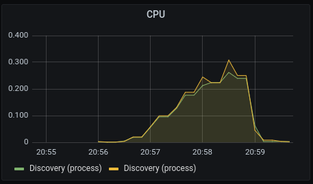

# Analyzing performance of the control plane

## What does istiod do?

Istio's control plane - istiod - watches Kubernetes objects, like Services, Endpoints, Pods, ConfigMaps, etc.
When an object is updated, istiod receives an event from the Kubernetes api-server, updates Envoy configuration
and sends to relevant proxies.

The process of updating Envoy proxies is performed in the following order:
1. Event: an event from watched resources triggers istiod to update Envoy configuration.
2. Debounce: istiod delays adding the event to the push queue for a defined time to batch and merge subsequent events for that period. Debouncing can be tuned with `PILOT_DEBOUNCE_AFTER` (100ms by default).
3. Add to queue: when the delay period expires, istiod adds the events to the push queue.
4. Throttle: istiod throttles push requests from the queue and sends to connected proxies. Throttling prevents processing all events concurrently and CPU overloading. Throttling can be tuned with `PILOT_PUSH_THROTTLE`.
5. Send Envoy config to proxies: istiod generates Envoy configs, like clusters, listeners, etc., from push requests and sends to connected proxies.

## Factors affecting istiod performance

1. Number of changes in watched objects - more changes in watched objects require sending more updates to relevant proxies.
2. Allocated resources - if the amount of updates to perform by istiod exceeds its limits, the push requests must be queued and proxy configurations are longer out of date.
3. Number of proxies to update - more CPU, memory and network bandwith is required to update more proxies.
4. Envoy configuration size - same as above.

## Monitoring the control plane

### Latency

First you need to check how quickly proxies are updated. The key metrics:

1. `pilot_proxy_convergence_time` (distribution) - delay in seconds between config change and a proxy receiving all required configuration.

This metric is visualized in Grafana as "Proxy Push Time" in the dashboard "Istio Control Plane".


2. `pilot_proxy_queue_time` (distribution) - time in seconds, a proxy is in the push queue before being dequeued.
3. `pilot_xds_push_time` (distribution) - total time in seconds Pilot takes to push lds, rds, cds and eds.

The first metrics is usually sufficient to understand what happens.

### Resource usage

Most of the work performed by istiod is CPU-intensive, so you usually need to look at:

1. `container_cpu_usage_seconds_total` - CPU usage reported by Kubernetes.
2. `process_cpu_seconds_total` - CPU usage reported by istiod.
This metric is visualized in Grafana as "CPU" in the dashboard "Istio Control Plane":

   

### Traffic

There are 2 factors affecting load on istiod: inbound requests and outbound push requests.
Inbound requests are new XDS connections from proxies and configuration updates made by users.
Outbound push requests are triggered by events from watched resources and configuration updates made by users.

Usually, the biggest impact on performance have events, so start from reviewing the following metrics:

1. `pilot_xds_pushes` (sum) - measures ops/s of all pushes made by istiod.

This metric is visualized in Grafana as "Pilot Pushes" in the dashboard "Istio Control Plane".

   

2. `pilot_xds` (last value) - number of endpoints connected to this pilot using XDS.

This metric is visualized in Grafana as "XDS Active Connections" in the dashboard "Istio Control Plane".

   

There are also inbound-related metrics worth to check:

1. `pilot_inbound_updates` (sum) - total number of updates received by pilot.
2. `pilot_push_triggers` (sum) - total number of times a push was triggered, labeled by reason for the push.
3. `pilot_services` (last value) - total services known to pilot.

For other metrics look at this [table](https://istio.io/latest/docs/reference/commands/pilot-discovery/#metrics).

### Metrics correlation

When analyzing performance problems, pay attention to the correlation of metrics - for example,
if you see CPU spikes, pay attention to the pilot pushes - the spikes should overlap.
If not, look at latency-related metrics. Before looking for problems with the platform,
make sure that the control plane metrics don't show any anomalies.

## Performance tuning

### Scaling istiod horizontally and/or vertically

By default, istiod deployed with `ServiceMeshControlPlane` has only **10m of CPU** and **128Mi of memory**.
These values are not universal and should be adjusted to the mesh size, rate of changes, traffic, etc.

```yaml
apiVersion: maistra.io/v2
kind: ServiceMeshControlPlane
metadata:
  name: basic
spec:
  runtime:
    components:
      pilot:
        container:
          resources:
            requests:
              cpu: 250m
              memory: 1024Mi
        deployment:
          replicas: 2
```

Scale istiod horizontally to reduce load on a single instance and split work across more instances.
Scale istiod vertically when you observe slow processing updates and CPU spikes.

#### TODO: Explain that proxies do not connect automatically to the new control plane.

### Filter out irrelevant updates

In most cases, applications communicate only with some of other applications, not all of them.
Then, you can limit the amount of updates being sent from the control plane to proxies. To be precise,
you can limit the number of clusters (CDS) and endpoints (EDS) being sent to proxies.

To do that, you just need to apply the `Sidecar` object with proper `spec.egress` setting:
```yaml
apiVersion: networking.istio.io/v1alpha3
kind: Sidecar
metadata:
  name: ratings
  namespace: bookinfo
spec:
  workloadSelector:
    labels:
      app: ratings
  egress:
  - hosts:
    - "istio-system/*"
    - "./reviews.bookinfo.svc.cluster.local"
```

In this case, the app `ratings` will receive clusters and endpoints only for `reviews.bookinfo.svc.cluster.local`
and services from the control plane namespace.

You can also define default mesh-wide `Sidecar` and additionally customize particular workloads.
For example, if your applications usually communicate with apps only from the same namespace, and only some
communication with apps from other namespaces, you can apply the following configuration:
```yaml
apiVersion: networking.istio.io/v1alpha3
kind: Sidecar
metadata:
  name: default
  namespace: istio-system
spec:
  egress:
  - hosts:
    - "./*"
    - "istio-system/*"
---
apiVersion: networking.istio.io/v1alpha3
kind: Sidecar
metadata:
  name: ratings
  namespace: bookinfo
spec:
  workloadSelector:
    labels:
      app: ratings
  egress:
  - hosts:
    - "istio-system/*"
    - "httpbin/*
```

Even though gateways are istio-proxies, the `Sidecar` resource is not applicable to gateways.
However, you can enable `PILOT_FILTER_GATEWAY_CLUSTER_CONFIG: true` to send only these clusters and endpoints,
which are used in a `VirtualService` configured for a particular gateway.

```yaml
apiVersion: maistra.io/v2
kind: ServiceMeshControlPlane
metadata:
  name: basic
spec:
  runtime:
    components:
      pilot:
        container:
          env:
            PILOT_FILTER_GATEWAY_CLUSTER_CONFIG: "true"
```

### Ignoring irrelvant events (only in cluster-wide mode)

If you have cluster-wide `ServiceMeshControlPlane`, you can define discovery selectors to specify from which namespaces
events should not be ignored by istiod.

```yaml
apiVersion: maistra.io/v2
kind: ServiceMeshControlPlane
metadata:
  name: basic
spec:
meshConfig:
  discoverySelectors:
  - matchLabels:
      env: prod
      region: us-east1
  - matchExpressions:
    - key: app
      operator: In
      values:
        - cassandra
        - spark
```

This is very usuful to avoid receiving events from openshift-* namespaces.

### Tweak batching events and throttling pushes

This is fairly advanced technique, which require very good understand what istiod does and what's the bottleneck.

Key environment variables:
1. `PILOT_DEBOUNCE_AFTER` (100ms by default) - The delay added to config/registry events for debouncing. This will delay the push by at least this interval. If no change is detected within this period, the push will happen, otherwise we'll keep delaying until things settle, up to a max of `PILOT_DEBOUNCE_MAX`.
2. `PILOT_DEBOUNCE_MAX` (10s by default) - The maximum amount of time to wait for events while debouncing. If events keep showing up with no breaks for this time, we'll trigger a push.
3. `PILOT_PUSH_THROTTLE` (0 by default) - Limits the number of concurrent pushes allowed. On larger machines this can be increased for faster pushes. If set to 0 or unset, the max will be automatically determined based on the machine size.

## Demo

### Prerequisites:
1. OpenShift cluster with 20-24 CPU and 50-60 GB of memory.
2. Service Mesh Operator 2.4.

### Setup environment and files
Create namespaces:
```shell
oc new-project istio-system
oc new-project httpbin
oc new-project sleep
```
```shell
for x in {1..20}
do
  oc new-project bookinfo-$x
done
```
Prepare SMMR configuration with 20 bookinfo namespaces:
```shell
cat <<EOF >> smmr.yaml
apiVersion: maistra.io/v1
kind: ServiceMeshMemberRoll
metadata:
  name: default
  namespace: istio-system
spec:
  members:
  - httpbin
  - sleep
EOF
for x in {1..20}
do
  printf "  - bookinfo-$x\n" >> smmr.yaml
done
```
Prepare SMCP configs:
```shell
cat <<EOF >> smcp.yaml
apiVersion: maistra.io/v2
kind: ServiceMeshControlPlane
metadata:
  name: basic
spec:
  addons:
    kiali:
      enabled: false
    prometheus:
      enabled: true
    grafana:
      enabled: true
  gateways:
    egress:
      enabled: false
  general:
    logging:
      componentLevels:
        default: info
  proxy:
    accessLogging:
      file:
        name: /dev/stdout
  tracing:
    type: None
  version: v2.4
EOF
cat <<EOF >> smcp-scaled-horizontally.yaml
apiVersion: maistra.io/v2
kind: ServiceMeshControlPlane
metadata:
  name: basic
spec:
  addons:
    kiali:
      enabled: false
    prometheus:
      enabled: true
    grafana:
      enabled: true
  gateways:
    egress:
      enabled: false
  general:
    logging:
      componentLevels:
        default: info
  proxy:
    accessLogging:
      file:
        name: /dev/stdout
  runtime:
    components:
      pilot:
        deployment:
          replicas: 2
  tracing:
    type: None
  version: v2.4
EOF
cat <<EOF >> smcp-scaled-horizontally-and-vertically.yaml
apiVersion: maistra.io/v2
kind: ServiceMeshControlPlane
metadata:
  name: basic
spec:
  addons:
    kiali:
      enabled: false
    prometheus:
      enabled: true
    grafana:
      enabled: true
  gateways:
    egress:
      enabled: false
  general:
    logging:
      componentLevels:
        default: info
  proxy:
    accessLogging:
      file:
        name: /dev/stdout
  runtime:
    components:
      pilot:
        container:
          resources:
            requests:
              cpu: 250m
              memory: 1024Mi
        deployment:
          replicas: 2
  tracing:
    type: None
  version: v2.4
EOF
```

### Default deployment

First, let's deploy SMCP with default resources:
```shell
oc apply -f smcp.yaml -n istio-system
oc apply -f smmr.yaml -n istio-system
```

Wait until all components are ready and deploy 20 bookinfo apps (120 pods):
```shell
for x in {1..20}
do
  oc apply -f https://raw.githubusercontent.com/maistra/istio/maistra-2.4/samples/bookinfo/platform/kube/bookinfo.yaml -n bookinfo-$x
done
```

Now, go to Grafana -> Istio Control Plane dashboard and see the following metrics:
1. CPU:

    
2. Pilot Pushes:

    
3. Proxy Push Time:

    

As you can see, 99.9% of proxies were waiting 30s to receive XDS configuration.

### Scale istiod horizontally and vertically

Now, deploy 2 istiod replicas with 250m of CPU and 1024Mi of memery:
```shell
oc apply -f smcp-scaled.yaml -n istio-system
```

Wait for new instances and redeploy apps to trigger push events:
```shell
for x in {1..20}
do
  oc get deploy -n bookinfo-$x | awk '{print $1}' | awk '!/NAME/' | xargs oc -n bookinfo-$x rollout restart deployment
done
```

Go to Grafana, look at the Istio Control Plane dashboard and compare results:

1. CPU:

   
2. Pilot Pushes:

   
3. Proxy Push Time:

   

As you can see, proxy push time dropped significantly and P99 is only 991ms - 20 times faster!
There is also visible CPU spike, but each replica handles concurrently half as many requests,
so processing is more efficient.

It would be also worth to compare `pilot_proxy_queue_time` and `pilot_xds_push_time`.

### Remember about long living connections

Keep in mind that deploying additional replica will have no impact on performance immediately.
Actually, metrics should not change at all. This is because XDS protocol uses gRPC protocol,
so existing connections will be alive until they are not restarted or istiod is restarted.
Then connections will be terminated and new connections should be routed to both instances equally.

```shell
oc apply -f smcp.yaml -n istio-system
```

```shell
for x in {1..20}
do
  oc get deploy -n bookinfo-$x | awk '{print $1}' | awk '!/NAME/' | xargs oc -n bookinfo-$x rollout restart deployment
done
```

Deploy additional replica of istiod:
```shell
oc apply -f smcp-2-replicas.yaml -n istio-system
```

Add ports to details service to generate additional clusters and endpoints:
```shell
for x in {1..20}
do
  oc apply -n bookinfo-$x -f - <<EOF
apiVersion: v1
kind: Service
metadata:
  name: details
  labels:
    app: details
    service: details
spec:
  ports:
  - port: 9080
    name: http
  - port: 9081
    name: http-1
  - port: 9082
    name: http-2
  - port: 9083
    name: http-3
  - port: 9084
    name: http-4
  selector:
    app: details
EOF
done
```

Go to Grafana, look at the Istio Control Plane dashboard and analyze results:

1. CPU:

   
2. Pilot Pushes:

   
3. Proxy Push Time:

   

As you can see on the last graph, P99 of proxy push time was almost 10s.
This is because only the old instance handled all push requests. You can notice that
on the CPU graph - the new line (yellow) is almost flat and the old one has a spike.

Now you can restart proxies and compare results.

In a production environment, a better idea would be a rollout restart of istiod,
because that would trigger all proxies to reconnect as well.
