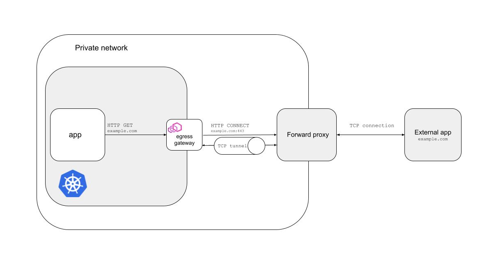

## Tunneling outbound traffic with Istio

This repository contains my scripts and configs to develop and test Istio [tunneling API](https://istio.io/latest/docs/reference/config/networking/destination-rule/#TrafficPolicy-TunnelSettings).



### Setup tools and environment

#### 1. Istio 1.15
```sh
curl -L https://istio.io/downloadIstio | ISTIO_VERSION=1.15.0 TARGET_ARCH=x86_64 sh -
export PATH=$PWD/istio-1.15.0/bin:$PATH
```

#### 2. Envoy
Envoy is used as the forward proxy. The script below pulls container with Envoy and extracts binary to host.
```sh
./infra/forward-proxy/get-envoy.sh
mv envoy infra/forward-proxy
```

#### 3. Kubernetes
```sh
wget -O k0s "https://github.com/k0sproject/k0s/releases/download/v1.24.4+k0s.0/k0s-v1.24.4+k0s.0-amd64"
chmod u+x k0s
mv k0s infra/k8s
```

#### 4. Nginx configurations
```sh
ansible-playbook infra/external-app/generate-nginx-configs.yaml
```

#### 5. Run VMs
```sh
vagrant up
```

#### 6. Configure kube config file
```sh
vagrant ssh k8s -c 'sudo cat /var/lib/k0s/pki/admin.conf' > ~/.kube/config-vagrant-k0s
export KUBECONFIG=~/.kube/config-vagrant-k0s
```

#### 7. Install Istio
```sh
istioctl install -y \
    --set profile=demo \
    --set meshConfig.accessLogFile=/dev/stdout \
    --set meshConfig.outboundTrafficPolicy.mode=REGISTRY_ONLY
```
